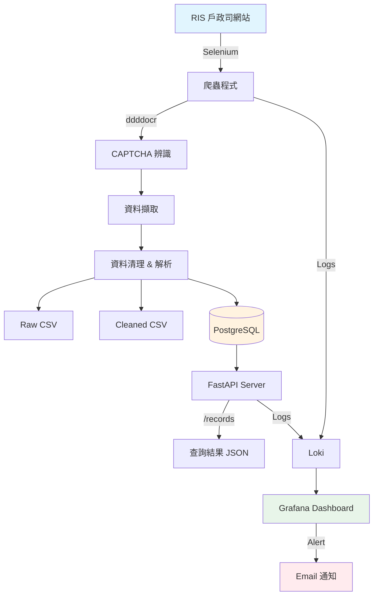

# RIS Scraper System - 系統架構圖

## 架構總覽

```
┌─────────────────────────────────────────────────────────────────────────────┐
│                           RIS Scraper System                                 │
└─────────────────────────────────────────────────────────────────────────────┘

                                    │
                                    ▼
┌─────────────────────────────────────────────────────────────────────────────┐
│                         試題1: 爬蟲程式 (Scraper)                            │
│  ┌──────────────┐    ┌──────────────┐    ┌──────────────┐                   │
│  │   Selenium   │───▶│  CAPTCHA OCR │───▶│ Data Parser  │                   │
│  │  WebDriver   │    │  (ddddocr)   │    │              │                   │
│  └──────────────┘    └──────────────┘    └──────────────┘                   │
│         │                                       │                            │
│         ▼                                       ▼                            │
│  ┌──────────────┐                       ┌──────────────┐                    │
│  │  RIS 網站    │                       │   CSV 檔案   │                    │
│  │ (戶政司門牌) │                       │  (Raw/Clean) │                    │
│  └──────────────┘                       └──────────────┘                    │
└─────────────────────────────────────────────────────────────────────────────┘
                                    │
                                    ▼
┌─────────────────────────────────────────────────────────────────────────────┐
│                            PostgreSQL Database                               │
│  ┌──────────────────────────────────────────────────────────────────────┐   │
│  │  house_number_records                                                 │   │
│  │  - city, district, village, neighborhood                              │   │
│  │  - road, section, lane, alley, number, floor                         │   │
│  │  - assignment_date, assignment_type                                   │   │
│  └──────────────────────────────────────────────────────────────────────┘   │
│  ┌──────────────────────────────────────────────────────────────────────┐   │
│  │  scraper_execution_log (執行紀錄)                                     │   │
│  └──────────────────────────────────────────────────────────────────────┘   │
└─────────────────────────────────────────────────────────────────────────────┘
                                    │
                                    ▼
┌─────────────────────────────────────────────────────────────────────────────┐
│                        試題2: API 服務 (FastAPI)                             │
│  ┌──────────────┐    ┌──────────────┐    ┌──────────────┐                   │
│  │  /records    │    │  /health     │    │   /docs      │                   │
│  │  查詢門牌    │    │  健康檢查    │    │  Swagger UI  │                   │
│  └──────────────┘    └──────────────┘    └──────────────┘                   │
│         │                                                                    │
│         ▼                                                                    │
│  Input: { "city": "臺北市", "township": "大安區" }                           │
│  Output: [ { address, village, road, floor, ... } ]                         │
└─────────────────────────────────────────────────────────────────────────────┘
                                    │
                                    ▼
┌─────────────────────────────────────────────────────────────────────────────┐
│                    試題3: Log 收集 & 異常通報                                │
│                                                                              │
│  ┌──────────────┐    ┌──────────────┐    ┌──────────────┐                   │
│  │    Loki      │◀───│   Scraper    │    │   Grafana    │                   │
│  │  Log Store   │    │     Logs     │    │  Dashboard   │                   │
│  └──────────────┘    └──────────────┘    └──────────────┘                   │
│         │                   │                   │                            │
│         ▼                   ▼                   ▼                            │
│  ┌──────────────┐    ┌──────────────┐    ┌──────────────┐                   │
│  │  Query Logs  │    │   API Logs   │    │    Alert     │                   │
│  │  歷史查詢    │    │   查詢紀錄   │    │  Email 通知  │                   │
│  └──────────────┘    └──────────────┘    └──────────────┘                   │
│                                                                              │
│  Alert Conditions:                                                           │
│  - 爬蟲執行失敗 → Email 通知                                                │
│  - API 查詢結果為空 → Email 通知                                            │
└─────────────────────────────────────────────────────────────────────────────┘


## Docker Compose 服務架構

┌─────────────────────────────────────────────────────────────────────────────┐
│                          Docker Compose Stack                                │
│                                                                              │
│  ┌─────────────┐  ┌─────────────┐  ┌─────────────┐  ┌─────────────┐        │
│  │  postgres   │  │    api      │  │    loki     │  │   grafana   │        │
│  │   :5432     │  │   :8000     │  │   :3100     │  │   :3000     │        │
│  └─────────────┘  └─────────────┘  └─────────────┘  └─────────────┘        │
│        │               │                 │                │                 │
│        └───────────────┼─────────────────┼────────────────┘                 │
│                        │                 │                                   │
│                        ▼                 ▼                                   │
│                 ┌─────────────┐  ┌─────────────┐                            │
│                 │   pgadmin   │  │  promtail   │                            │
│                 │   :5050     │  │  (optional) │                            │
│                 └─────────────┘  └─────────────┘                            │
└─────────────────────────────────────────────────────────────────────────────┘


## 資料流程圖




## 技術選型說明

| 元件 | 技術 | 選用原因 |
|------|------|----------|
| 爬蟲框架 | Selenium | 網站使用 JavaScript 動態載入，需要瀏覽器渲染 |
| CAPTCHA | ddddocr | 開源 OCR，對簡單驗證碼辨識率高 |
| 資料庫 | PostgreSQL | 穩定、支援 JSON、適合結構化資料 |
| API | FastAPI | 高效能、自動生成 OpenAPI 文件 |
| Log 收集 | Loki | 輕量級、與 Grafana 整合良好 |
| 監控平台 | Grafana | 開源、視覺化強、支援告警 |
| 容器化 | Docker Compose | 簡化部署、服務編排 |
